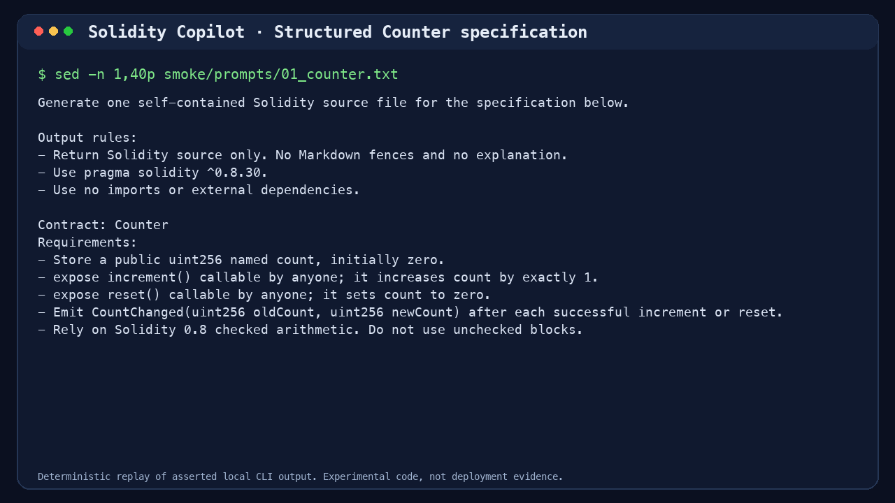

# Solidity Copilot

A hands-on project for turning example contract specs into Solidity code, then checking what the model actually produces.

## What this is

This is a learning-first build.

The goal is to explore a small, practical workflow:

1. give the model a contract prompt or reference contract
2. have it generate Solidity output
3. inspect the result
4. test or compile it
5. repeat with better examples and better prompts

## Starting point

We are keeping the first version flexible.

That means:
- no heavy central plan
- no rigid data governance system up front
- no early fine-tuning assumptions
- no fake confidence about production readiness

## Good first milestones

- try a few example contract prompts by hand
- see what a base model can do before training anything
- learn where the failures are: syntax, structure, missing invariants, style, or reasoning
- decide later whether retrieval, prompt engineering, LoRA, or something else is worth it

## Safety boundary

Generated contracts are experimental artifacts. They are not audited, deployment-ready financial software. No private keys, live deployment automation, or mainnet transaction paths belong here.

## Portfolio media



The evidence kit is a deterministic rendered terminal-style replay of asserted local CLI output. Foundry elapsed-time fields are normalized to `<elapsed>` before rendering and hashing. It shows the structured Counter specification, a raw response that violated the source-only instruction with Markdown fences, the normalized compile candidate, and Foundry smoke results for Counter, PiggyBank, and SimpleToken. It makes no model calls, accesses no private keys, and does not deploy or broadcast anything.

- [Short walkthrough](https://www.youtube.com/watch?v=EHUMwDOO9IU)
- [Full walkthrough](https://www.youtube.com/watch?v=hutz7hgIflE)
- [Raw output format failure](public/screenshots/03-output-format-failure.png)
- [Full Foundry smoke suite](public/screenshots/08-full-smoke-suite.png)

Regenerate the kit after changing its inputs. It requires Python 3.10+, Pillow, FFmpeg, and Foundry. Install Pillow with `python3 -m pip install Pillow`; install FFmpeg and Foundry through your platform's package manager. The renderer uses Menlo on macOS, DejaVu Sans Mono when available elsewhere, then Pillow's default font.

```sh
python3 scripts/capture_cli_media.py
```

## Repo layout

- `README.md` - project overview
- `scripts/` - helper scripts when we need them
- `tests/` - examples and checks as the project grows
- `notes/` - scratch notes and experiments if needed

## License

MIT.
